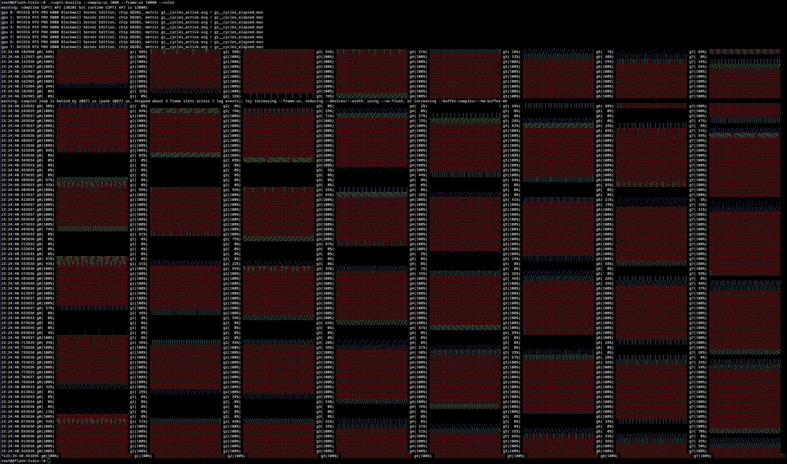
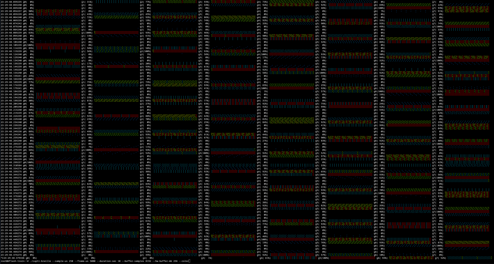
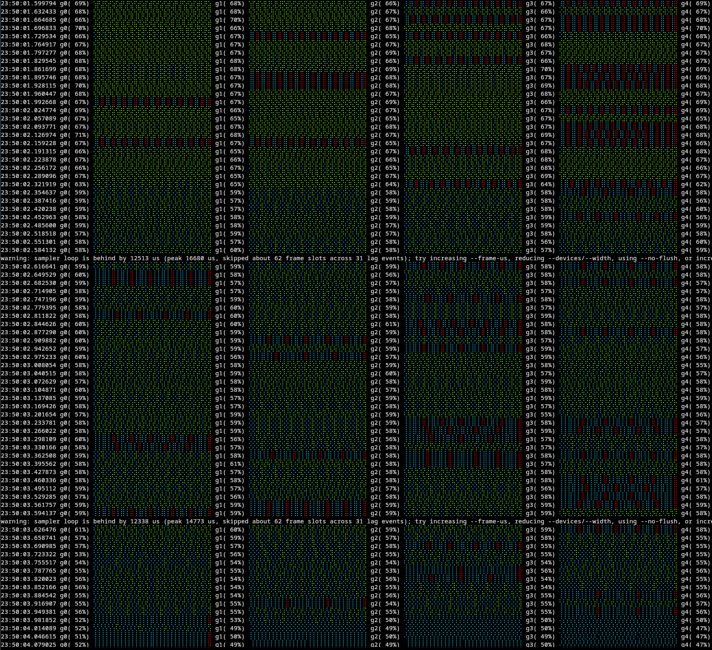

# cufall

`cufall` is a small CUPTI PM-sampling terminal monitor for NVIDIA GPUs. It renders high-frequency GPU activity as compact Braille bands so multi-GPU LLM training and inference behavior is visible directly in a terminal.

It is designed for quick external observation of patterns such as prefill/decode shifts, pipeline-parallel bubbles, tensor/expert/data-parallel communication, and memory-pressure phases. It does not require instrumenting the target CUDA application.

## Screenshots



Default multi-GPU activity view.



Pipeline-parallel style activity with staggered utilization across GPUs.



Expert-parallel SM usage with uneven work distribution across GPUs.

## Features

- CUPTI PM Sampling based, not NVML polling.
- Multi-GPU sampling with one compact band per selected GPU.
- Default 1 kHz PM samples and 100 output rows per second.
- Local timestamps on every output row in `hh:mm:ss.xxxxxx` format.
- Per-row average utilization gauges, for example `g0( 34%)`.
- Optional ANSI foreground color per Braille cell with `--color`.
- Ratio mode for activity metrics and percent mode for throughput metrics.
- Throttled warnings when decode/render falls behind the requested cadence.
- Immediate warnings for PM sampling buffer overflow.

## Requirements

- Linux.
- NVIDIA driver with CUPTI PM Sampling support.
- CUDA Toolkit with CUPTI and NVPerf Host libraries.
- C++17 compiler.
- NVIDIA performance-counter permission.

By default the `Makefile` expects CUDA under `/opt/cuda/targets/x86_64-linux`. Override `CUDA_HOME` if your install is elsewhere.

## Build

```bash
make
```

Build with a different CUDA path:

```bash
make CUDA_HOME=/usr/local/cuda
```

Install to `/usr/local/bin`:

```bash
make install
```

Install somewhere else:

```bash
make install PREFIX=$HOME/.local
```

## Quick Start

Run all GPUs at 1 kHz PM sampling and 100 output rows per second:

```bash
./cufall --sample-us 1000 --frame-us 10000
```

Colorized all-GPU overview:

```bash
./cufall --devices all --color --sample-us 1000 --frame-us 10000 --width 32
```

Check CUDA/CUPTI versions used by the binary on a target machine:

```bash
./cufall --version
```

Show all CLI options and embedded metric examples:

```bash
./cufall --help
```

## Output

Each output row starts with a local timestamp, then one band per GPU:

```text
23:26:27.507739 g0(  5%) ... g1(  4%) ... g2( 31%) ...
```

The percentage in `gN( XX%)` is the current output row's average normalized value for that GPU. The Braille band fills left-to-right and bottom-to-top within each cell. Blank Braille cells are U+2800, so fully idle bands can look like whitespace.

Without `--color`, no ANSI color sequences are emitted. With `--color`, only non-blank Braille cells are colored and the renderer only emits a new color sequence when the next cell's utilization bucket changes.

## Useful Profiles

General GPU busy signal:

```bash
./cufall --sample-us 1000 --frame-us 10000
```

LLM server overview across all GPUs:

```bash
./cufall --devices all --sample-us 1000 --frame-us 10000 --width 32
```

LLM SM active view, useful for prefill/decode occupancy changes:

```bash
./cufall --metric sm__cycles_active.avg --denominator gr__cycles_elapsed.max
```

Tensor Core activity, if available on the target CUPTI/GPU:

```bash
./cufall --metric sm__pipe_tensor_cycles_active.avg --denominator gr__cycles_elapsed.max
```

Memory-bandwidth pressure, if the percent throughput metric is available:

```bash
./cufall --metric dram__throughput.avg.pct_of_peak_sustained_elapsed --no-denominator --full-scale 100
```

Short high-rate debugging window, 4 kHz PM samples and 200 rows per second:

```bash
./cufall --sample-us 250 --frame-us 5000 --duration-sec 10 --buffer-samples 8192 --hw-buffer-mb 256
```

Lower-overhead long watch, 500 Hz PM samples and 50 rows per second:

```bash
./cufall --sample-us 2000 --frame-us 20000
```

## Metric Modes

Default activity is:

```text
gr__cycles_active.avg / gr__cycles_elapsed.max
```

Override it with a numerator/denominator pair:

```bash
./cufall --metric sm__cycles_active.avg --denominator gr__cycles_elapsed.max
```

Use a single percent-style metric with an explicit full scale:

```bash
./cufall --metric sm__throughput.avg.pct_of_peak_sustained_elapsed --no-denominator --full-scale 100
```

Ratio mode renders `clamp(metric / denominator, 0..1)`. Percent mode renders `clamp(metric / full-scale, 0..1)`.

Metric names are CUPTI/PerfWorks names and vary by GPU architecture and CUPTI release. Unsupported metric names fail during startup before sampling begins.

## Communication And Sync Examples

PM sampling does not trace CUDA/NCCL synchronization APIs directly. Infer waits from SM/Tensor idle gaps, peer GPUs staying busy, and fabric or PCIe bursts. Use Nsight Systems when you need exact CUDA/NCCL API attribution.

Pipeline/data/expert-parallel bubbles or explicit sync waits across GPUs:

```bash
./cufall --devices all --metric sm__cycles_active.avg --denominator gr__cycles_elapsed.max --width 16
```

PCIe/off-node staging pressure, useful when NIC traffic lands through PCIe:

```bash
./cufall --metric pcie__throughput.avg.pct_of_peak_sustained_elapsed --no-denominator --full-scale 100
```

PCIe ingress bytes/s, tune `--full-scale` to expected link bandwidth:

```bash
./cufall --metric pcie__read_bytes.sum.per_second --no-denominator --full-scale 64000000000
```

PCIe egress bytes/s, tune `--full-scale` to expected link bandwidth:

```bash
./cufall --metric pcie__write_bytes.sum.per_second --no-denominator --full-scale 64000000000
```

Decode/KV-cache memory pressure, common when Tensor Cores are not saturated:

```bash
./cufall --metric dram__throughput.avg.pct_of_peak_sustained_elapsed --no-denominator --full-scale 100
```

NVLink-only systems may also expose `nvlrx__...` and `nvltx__...` metrics. Systems without NVLink reject those metric names during startup.

## LLM Metric Cheat Sheet

Use `.pct_of_peak...` metrics with `--no-denominator --full-scale 100`. Use active-cycle `.avg` metrics with `--denominator gr__cycles_elapsed.max`.

| # | Metric | Useful For |
| - | - | - |
| 1 | `gr__cycles_active.avg` | whole GPU busy / pipeline-parallel bubbles |
| 2 | `gr__cycles_elapsed.max` | denominator for ratio views |
| 3 | `sm__cycles_active.avg` | SM residency / CUDA work present |
| 4 | `sm__throughput.avg.pct_of_peak_sustained_elapsed` | compute speed-of-light for prefill/train |
| 5 | `sm__warps_active.avg.pct_of_peak_sustained_active` | achieved occupancy / latency hiding |
| 6 | `smsp__warps_active.avg.pct_of_peak_sustained_active` | per-scheduler occupancy skew |
| 7 | `smsp__warps_eligible.sum.per_cycle_active` | scheduler has runnable warps |
| 8 | `smsp__issue_active.avg.pct_of_peak_sustained_active` | issue slot utilization |
| 9 | `sm__pipe_tensor_cycles_active.avg` | Tensor Core active cycles |
| 10 | `sm__inst_executed_pipe_tensor.sum` | Tensor pipe instruction volume |
| 11 | `sm__pipe_tensor_op_hmma_cycles_active.avg` | FP16/BF16 HMMA Tensor Core activity |
| 12 | `sm__inst_executed_pipe_tensor_op_hmma.sum` | FP16/BF16 HMMA instruction volume |
| 13 | `sm__inst_executed_pipe_tensor_op_imma.sum` | INT8/INT4 IMMA instruction volume |
| 14 | `sm__pipe_fma_cycles_active.avg` | CUDA-core FP activity fallback |
| 15 | `sm__inst_executed_pipe_fma.sum` | FP32/FP64 FMA instruction volume |
| 16 | `sm__inst_executed_pipe_alu.sum` | integer/control overhead |
| 17 | `dram__throughput.avg.pct_of_peak_sustained_elapsed` | HBM pressure / decode bottlenecks |
| 18 | `dram__bytes_read.sum` | HBM read volume, KV/cache reads |
| 19 | `dram__bytes_write.sum` | HBM write volume, optimizer/KV writes |
| 20 | `dram__sectors_read.sum` | HBM read transactions |
| 21 | `dram__sectors_write.sum` | HBM write transactions |
| 22 | `lts__throughput.avg.pct_of_peak_sustained_elapsed` | L2 pressure |
| 23 | `lts__t_bytes.sum` | L2 byte traffic |
| 24 | `lts__t_sectors_op_read.sum` | L2 read sectors |
| 25 | `lts__t_sectors_op_write.sum` | L2 write sectors |
| 26 | `l1tex__throughput.avg.pct_of_peak_sustained_elapsed` | L1/TEX/shared-memory pressure |
| 27 | `pcie__throughput.avg.pct_of_peak_sustained_elapsed` | PCIe/NIC staging pressure |
| 28 | `pcie__read_bytes.sum.per_second` | PCIe ingress bandwidth |
| 29 | `pcie__write_bytes.sum.per_second` | PCIe egress bandwidth |
| 30 | `pcie__throughput.avg.pct_of_peak_sustained_active` | PCIe active-cycle saturation |

## Troubleshooting

- CUPTI PM sampling requires NVIDIA performance-counter permission. If restricted, run with sufficient privileges or allow non-admin profiling in the driver settings.
- Metric names tied to absent hardware are rejected at startup. For example, `nvlrx__...` and `nvltx__...` are invalid on GPUs/systems without NVLink.
- `cuptiProfilerDeviceSupported()` is treated as a best-effort preflight check. Some CUPTI builds reject that query with `CUPTI_ERROR_INVALID_PARAMETER`, so the tool warns and lets the real PM sampling setup decide support.
- `--trigger time` uses nanosecond sampling intervals and is the default. Use `--trigger sysclk --sysclk-cycles N` if fixed-time triggering is unsupported on the target GPU.
- If warnings say the sampler loop is behind, increase `--frame-us`, reduce `--devices` or `--width`, use `--no-flush`, or increase `--buffer-samples` and `--hw-buffer-mb`.
- If PM sampling buffer overflow is reported, increase `--hw-buffer-mb`, increase `--buffer-samples`, or decode less often by increasing `--frame-us`.

## Contributing

See [CONTRIBUTING.md](CONTRIBUTING.md).

## License

MIT. See [LICENSE](LICENSE).
